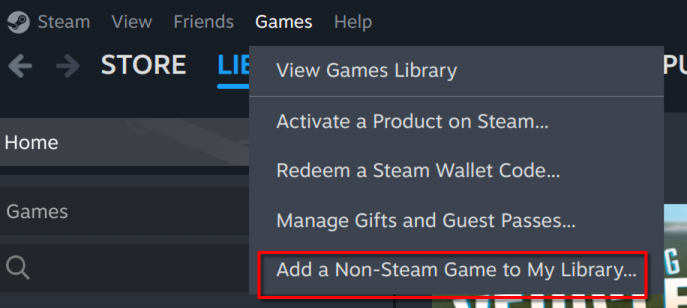
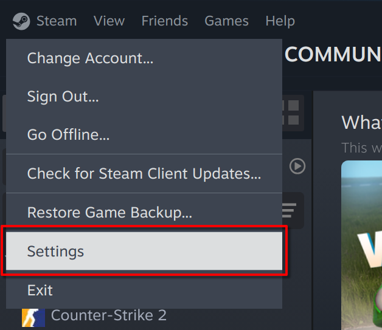
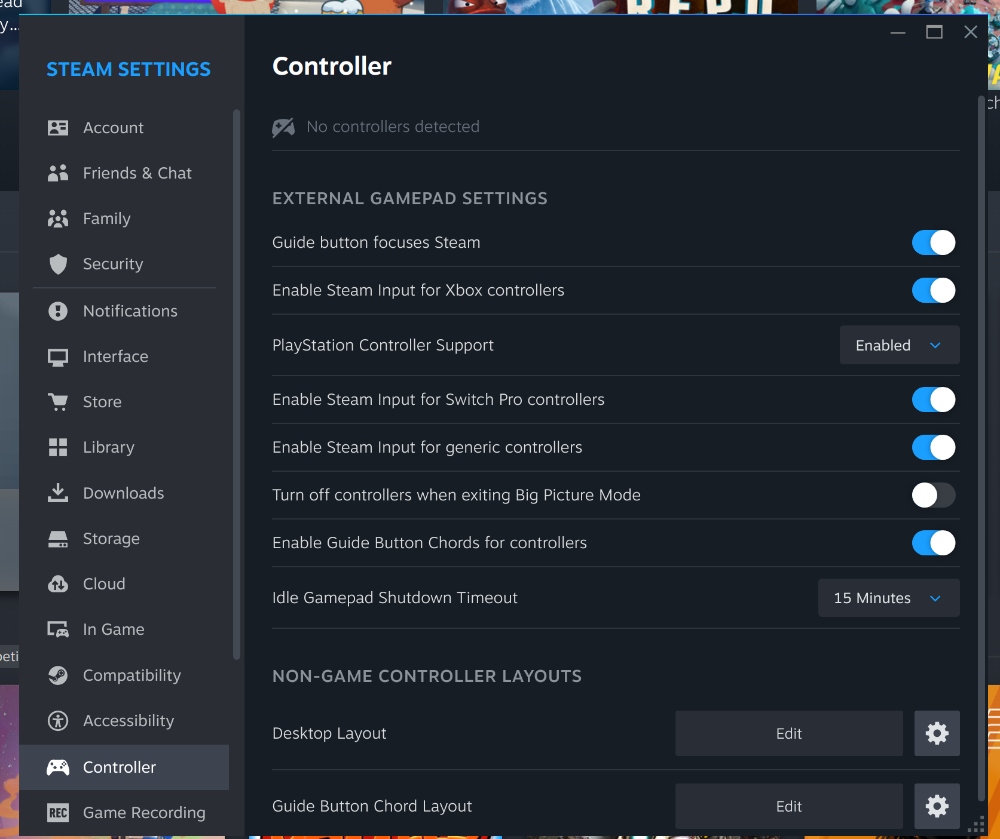

# Method 4: Steam Virtual Gamepad


This method is only for Linux. This will not work on Windows or Mac


#### Pros

* Connect using USB or Bluetooth
* Supports a huge varity of gamepads. See [Steam Input documentation](https://partner.steamgames.com/doc/features/steam\_controller/device)
* Supports Steam Deck

#### Cons

* Linux only
* Steam must be installed on your system

## Tutorial


This tutorial needs more testing. If you are running Linux, please &#x20;



Ensure Steam is installed on your system before continuing with the tutorial


#### Step 1:

Add the Minecraft Launcher (or any other launcher) as a non-steam game on Steam.

1. Open the Steam Application
2. Select `Games` > `Add a Non-Steam Game to My Library` <figure><figcaption>
Add a Non-Steam Game to My Library Menu Option
</figcaption></figure>
3. Select the Minecraft Launcher of your choice.

> Have an image to place here? [Submit a pull request](https://github.com/MrCrayfish/Controllable-Documentation/pulls)

#### Step 2:

##### Option 1: Steam Big Picture Mode

Connect your controller to your system and launch Steam Big Picture. Locate the launcher in your library and hit `Play`. Steam's Virtual Gamepad will now be enabled in the background.&#x20;

> Have an image to place here? [Submit a pull request](https://github.com/MrCrayfish/Controllable-Documentation/pulls)

##### Option 2: 

Navigate to `Steam` > `Settings` > `Controllers` from the Steam application and settings dialog. `Enable Steam input` for your controller. Run the launcher from your library.

<figure><figcaption>
Settings Menu Option
</figcaption></figure>

<figure><figcaption>
Enable Controller Inputs in Steam Settings
</figcaption></figure>

#### Step 3:&#x20;

Start Minecraft in your launcher like you normally would, of course with Controllable installed too. Once the game has started, your controller should be automatically selected and work straight away. You can check if it's working correctly by navigating to the controller selection menu and you should see `Steam Virtual Gamepad` selected.

<figure><figcaption>
The selected controller should be Steam's virtual gamepad
</figcaption></figure>

You are now ready to play Minecraft with Controllable!

## Troubleshooting

Check out the Troubleshooting section in the sidebar for information

## More Information

Steam: [https://store.steampowered.com/](https://store.steampowered.com/)

Supported controllers: [https://partner.steamgames.com/doc/features/steam\_controller/device](https://partner.steamgames.com/doc/features/steam\_controller/device)
