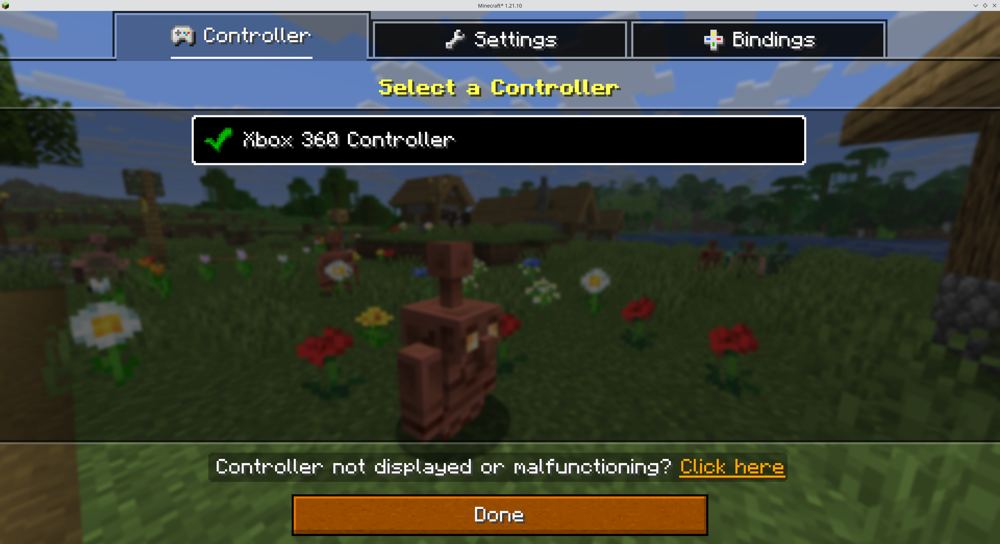

# Method 5: Linux - xpadneo


This method is only for Linux. This will not work on Windows or Mac


#### Pros

* Connect using Bluetooth
* Supports multiple gamepads. See [xpadneo Documentation](https://atar-axis.github.io/xpadneo/)
* No additional software required

#### Cons

* Linux only
* Does not support wired connections
* Modifying the system at a kernel level
* Semi-advanced setup

## Tutorial


This tutorial needs more testing. If you are running Linux, please &#x20;


#### Step 1:

Follow the instructions on the [xpadneo Getting Started Page](https://github.com/atar-axis/xpadneo?tab=readme-ov-file#getting-started) to install and set up xpadneo for your controller.

#### Step 2:

Ensure xpadneo is running by executing the following command in a terminal:

```bash
lsmod | grep xpadneo
```

The output should not be empty. An example result follows:

```plaintext
xpadneo               16384  0
```


If the controller is not connected, you may not see any output from the above command. Ensure you have followed the xpadneo instructions correctly.



#### Step 3:&#x20;

Start Minecraft in your launcher like you normally would, of course with Controllable installed too. Once the game has started, your controller should be automatically selected and work straight away. You can check if it's working correctly by navigating to the controller selection menu and you should see the controller selected.

<figure><figcaption><p>The selected controller should be shown</p></figcaption></figure>


The controller may show up differently from your actual controller model.


You are now ready to play Minecraft with Controllable!

## Troubleshooting

Check out the Troubleshooting section in the sidebar for information

## More Information

xpadneo Website: [https://atar-axis.github.io/xpadneo/](https://atar-axis.github.io/xpadneo/)

xpadneo GitHub: [https://github.com/atar-axis/xpadneo](https://github.com/atar-axis/xpadneo)
